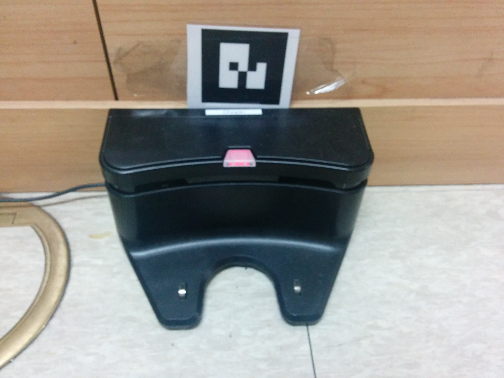

YOCS Docking Interactor
=======================

# Overview 

It allows to interact with Kobuki Docking statino with AR Marker. It provides apis to the following written in [yocs_msgs/DockingInteractor.action]

`docking_interactor` action

* WAKE_UP : It move backwards a bit and recognizes Docking AR Marker.
* REGISTER_DOCK_IN_GLOBAL_FRAME : Assumes that robot has been localized in global frame, and regiester the docking ar marker in global frame. So it can return to docking station later.
* RETURN_TO_DOCK : returns back to the docking station using the registered AR marker location,a nd runs IR based auto docking algorithm. 

# Dependency

* kobuki_auto_docking(Perhaps, we can make it more generic later)
* yocs_ar_marker_tracking(which uses [ar_track_alvar](http://wiki.ros.org/ar_track_alvar)
* yocs_navigator
* move_base

# Parameters

* global_frame(map) 
* base_frame(base_footprint)
* auto_dock_timeout(90.0)
* relay_on_marker_distance(1.0)
* docking_ar_min_confidence(0.3)
