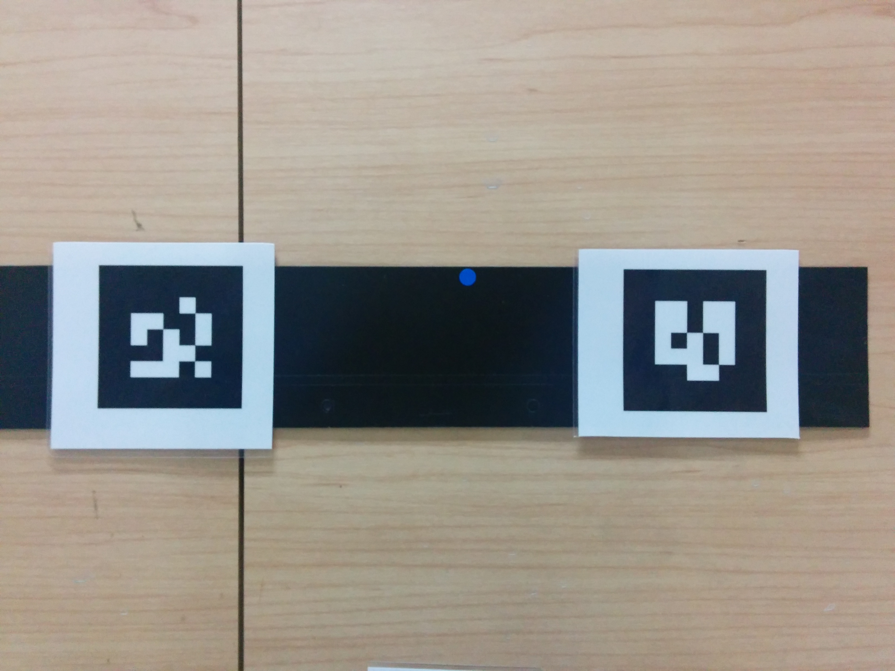

YOCS Localization Manager
=========================

# Overview

Provides action to localize the robot using AR Pair Markers

# APIs

`localize` action

* STAND_AND_LOCALIZE : Robot localizes using AR Pair in front.
* SPIN_AND_LOCALIZE : Robot roates to seek for AR Pair, and localize with spotted AR Pair.

# Parameters

* sleep_time(10)
* simulation(false)
* ar_pair_baseline(0.28)
* ar_pair_target_offset(0.5)
* timeout(10.0)

# Dependency

* yocs_ar_pair_tracking(which uses [ar_track_alvar](http://wiki.ros.org/ar_track_alvar))

