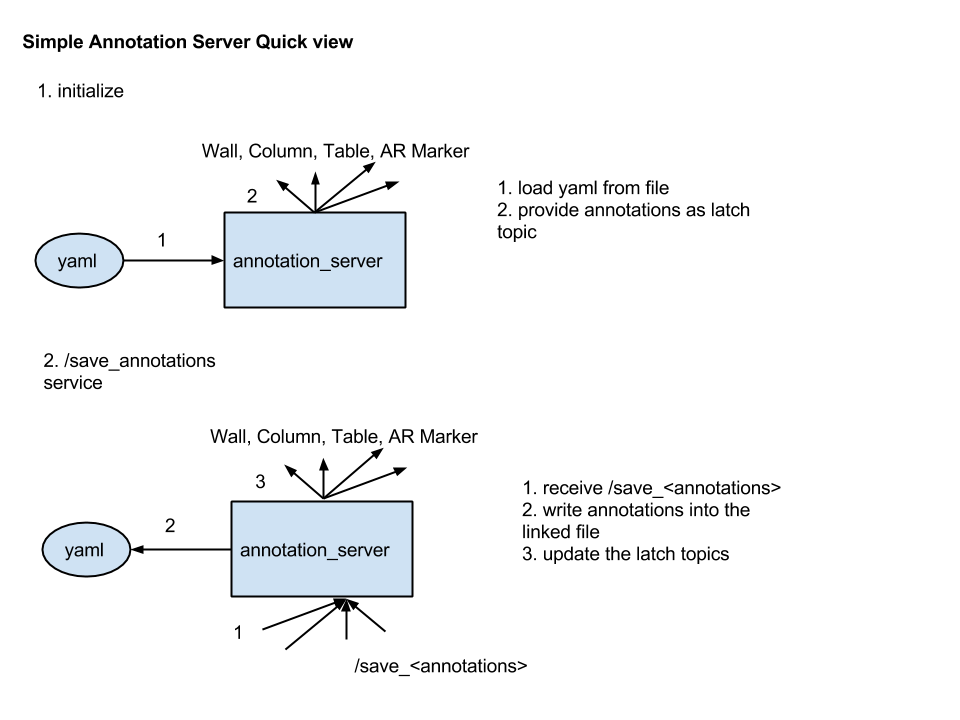

Simple Annotation Server
========================

A simple annotation server which associate with a file.

ROS APIs
--------

Topics
^^^^^^

* ``~tables`` `yocs_msgs`_/TableList
* ``~columns`` `yocs_msgs`_/ColumnList
* ``~walls`` `yocs_msgs`_/WallList
* ``~ar_markers`` `ar_track_alvar`_/AlvarMarkers

.. _`yocs_msgs`: https://github.com/yujinrobot/yocs_msgs/tree/hydro-devel/msg

Services
^^^^^^^^

* ``~save_annotations`` `yocs_msgs`_/AnnotationList

*yocs_msgs/AnnotationList*

.. code-block:: xml
    
    TableList tables
    ColumnList columns
    WallList  walls
    ar_track_alvar/AlvarMarkers ar_markers    

Parameters
^^^^^^^^^^

* ``~filename`` : a required parameter to point a file which associates with annotation server.

File format
-----------

.. code-block:: yaml
    
    # yocs_msgs/Table
    tables:
      - name:
        radius:
        ...
      - ...
      - ...

    # yocs_msgs/Column
    columns:
      - name: 
        radius:
        ...
      - ...
      - ...

    # yocs_msgs/Wall
    walls:
      - name:
        length: 
        ...
      - ...

    # ar_track_alvar/AlvarMarker
    ar_markers:
      - id:
        pose:
      - ...
